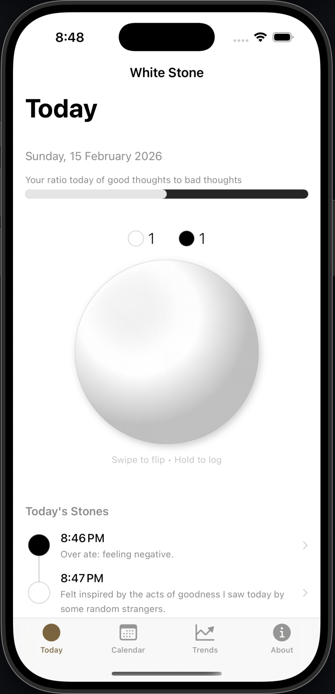
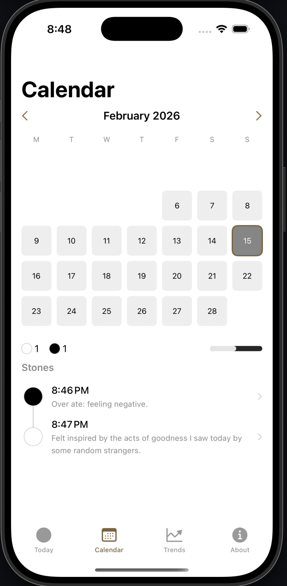
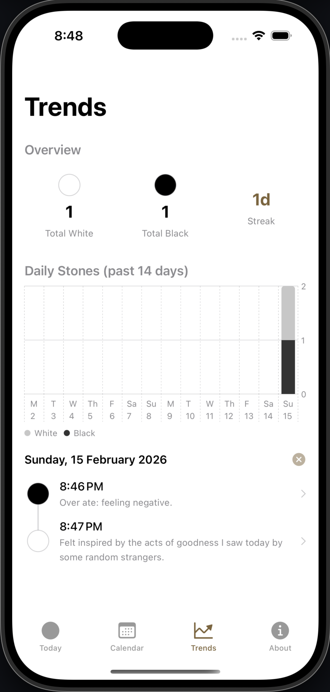
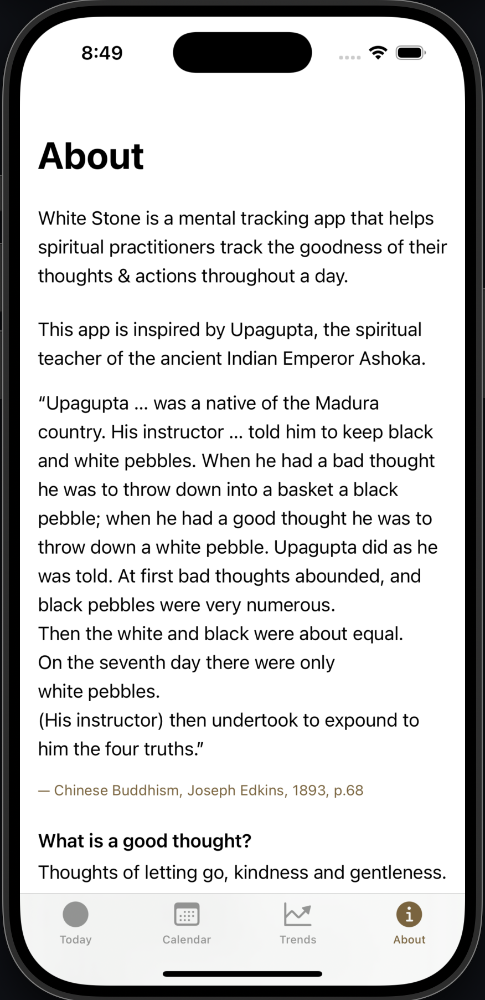

# White Stone

White Stone is a mental tracking app that helps spiritual practitioners track the goodness of their thoughts and actions throughout a day.

## Inspiration

This app is inspired by Upagupta, the spiritual teacher of the ancient Indian Emperor Ashoka.

> "Upagupta … was a native of the Madura country. His instructor … told him to keep black and white pebbles. When he had a bad thought he was to throw down into a basket a black pebble; when he had a good thought he was to throw down a white pebble. Upagupta did as he was told. At first bad thoughts abounded, and black pebbles were very numerous.
> Then the white and black were about equal.
> On the seventh day there were only white pebbles.
> (His instructor) then undertook to expound to him the four truths."
>
> — *Chinese Buddhism*, Joseph Edkins, 1893, p.68

**What is a good thought?** Thoughts of letting go, kindness and gentleness.

**What is a bad thought?** Thoughts of sensual desire, ill will and ruthlessness.

But you are free to decide for yourself what are good thoughts or bad thoughts that you will be tracking with White Stone.

## Screenshots

<p align="center">
  
  
  
  
</p>

## Features

- **First-run onboarding** — New users get a welcome sheet, a guided Today coach, a post-first-entry success sheet, then an inline Review tour card.
- **Today view** — A 3D interactive stone you swipe left/right to flip between white and black, and hold to log. See your daily tally and white/black ratio at a glance.
- **Review** — Month grid with days colour-coded by your white/black stone ratio, a preserved streak counter, 14-day bars, all-time monthly bars, reflection markers, and quiet pattern observations.
- **Reflections** — Daily AN 10.51 reflection prompts, saved responses, by-question review, and editable past reflections.
- **Optional stone tags** — Root and intensity tags can be added to stones and reviewed later.
- **About** — The story behind the app.

## Tech Stack

- **Platform:** Native iOS (iOS 17+)
- **UI:** SwiftUI
- **Storage:** SwiftData (local-first, no server)
- **Charts:** Swift Charts
- **Project generation:** XcodeGen (`project.yml` → `.xcodeproj`)
- **No third-party dependencies**

## Project Structure

```
WhiteStone/
  App/WhiteStoneApp.swift            # Entry point, SwiftData container
  Models/Stone.swift                  # @Model: type, timestamp, note
  Views/
    SplashView.swift                  # Launch screen
    ContentView.swift                 # TabView + first-run onboarding flow
    Today/TodayView.swift             # Main dashboard: flippable stone, coach overlay, ratio bar
    Today/RatioBar.swift              # White/black proportional bar
    AddStone/AddStoneSheet.swift      # Modal: stone type, time, and note
    Review/ReviewView.swift           # Calendar, stats, charts, and Review tour
    Review/Calendar/DayCell.swift     # Single day cell with ratio colour
    Review/Patterns/PatternsView.swift # Quiet pattern observations
    Reflection/ReflectionView.swift    # Daily and by-question reflection views
    StoneDetail/StoneDetailView.swift # Editable stone detail
    About/AboutView.swift             # App story and guidance
    Components/StoneIcon.swift        # Reusable 3D stone rendering
    Components/EmptyStateView.swift   # Empty state placeholder
  Utilities/
    DateHelpers.swift                 # Calendar math, date formatting
    ColorHelpers.swift                # Ratio-to-colour mapping
project.yml                           # XcodeGen config
```

## Building

```bash
# Install XcodeGen (one-time)
brew install xcodegen

# Generate Xcode project
xcodegen generate

# Build for simulator
xcodebuild -project WhiteStone.xcodeproj -scheme WhiteStone \
  -destination 'platform=iOS Simulator,name=iPhone 16,OS=latest' build

# Or open in Xcode
open WhiteStone.xcodeproj
```

## Recent Changes

### 5 May 2026

- Added local-only pattern observations in Review.
- Added unit tests for pattern observations, reflection question rotation, and stone tag behavior.
- Updated docs to reflect implemented Reflections and optional stone tagging.

### 1 May 2026

- Collapsed Calendar and Trends into a single Review tab.
- Preserved the existing stone-logging streak inside Review.
- Added Review sections for 14-day bars, all-time monthly bars, and a Patterns placeholder.
- Added the Reflections tab.

### 8 March 2026

- Added first-run onboarding with a welcome sheet, guided Today coach, and post-first-entry follow-up.
- Added lightweight feature nudges for Calendar and Trends after a user logs their first stone.
- Fixed the onboarding flow so the Calendar and Trends tours still appear after the first stone is saved.
- Increased onboarding modal contrast by using solid white tour cards instead of translucent material cards.
- Kept stored `dayKey` values in sync when editing a stone's timestamp.

### 28 February 2026

- Switched day/month grouping to timestamp-range fetching to avoid day-bucket drift across timezone changes.
- Fixed Trends chart tap detection by mapping taps to chart plot-area coordinates.
- Reworked Today/Calendar/Trends data loading to reduce repeated full-table scans.
- Synced Calendar day selection with month changes to avoid stale out-of-month selections.
- Removed unused `DayDetailView` and aligned docs/project files.

## Running on a Physical Device

1. Open `WhiteStone.xcodeproj` in Xcode
2. Xcode > Settings > Accounts > add your Apple ID
3. Select WhiteStone target > Signing & Capabilities > enable "Automatically manage signing" > select your Personal Team
4. Connect iPhone via USB, select it as build destination
5. Cmd+R to build and run
6. First time: on iPhone, go to Settings > General > VPN & Device Management > trust your developer profile
